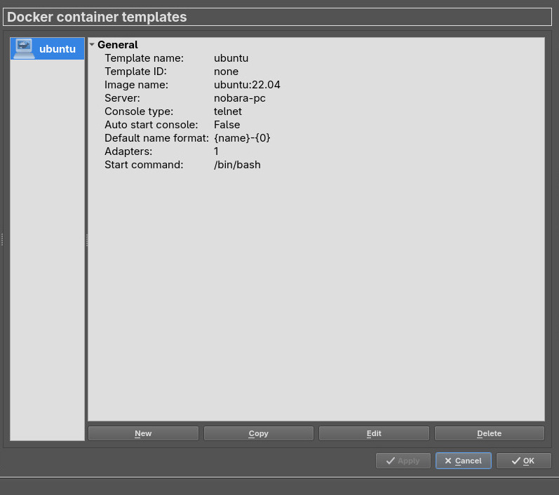

# syslog-analysis
Simulação de ambiente real para teste de viabilidade de uso de modelo de análise de logs em instituição de ensino para detecção de anomalias em máquinas de laboratório.

(descrição)

## Dependências
* xterm
* dynamips
* libvirt

Além de instalar o libvirt, também o habilite:
```console
sudo systemctl enable --now libvirtd
```

## Instalação

1. O primeiro passo é verificar se o GNS3 e Docker estão instalados e funcionando.

Verificar se o GNS3 está instalado:

```console
gns3
```
Verificar se o Docker está instalado:

```console
docker --version
```

Verificar se o Docker está rodando:

```console
docker ps
```

Verifique se há problemas de permissão:
```console
docker info
```
Caso haja:

```console
sudo usermod -aG docker $USER
```

2. Feito isso, vamos criar containers para as máquinas cliente e servidor.

Utilize o arquivo [Dockerfile](./docker-container/Dockerfile) e [entrypoint.sh](./docker-container/entrypoint.sh) para criar os containers.

Para buildar a imagem, rode:
```console
docker build -t docker-container:bullseye .
```

Confirme que não houve erro no build, e rode:
```console
docker images | grep docker-container
```

3. Feito isso, integrar o Docker ao GNS3

No GNS3, vá em Edit → Preferences → Server
* Confirme que 'Enable the local server' está marcado. 
* Host: localhost
* Port: 3080 TCP

Importar a imagem do container (vou utilizar Debian 11)

Docker → Docker containers → New → Existing image
* Image name: docker-container:bullseye (vai variar de acordo com sua imagem; rode ```console docker image ``` para verificar)
* Name: cliente
* Network adapters: 1
* Start command: vazio
* Console type: telnet
* Environment: vazio

Feito isso, o container deve aparecer como na imagem:

|  |
|:--:|
| Figura 1 - Container Docker Debian |

Para testar, arrasta uma máquina Debian para o projeto e clique em Start.

Faça os mesmos passos para criar uma máquina servidor. 

## Configurar rede local

1. Utilize um ethernet switch para conectar as duas máquinas.
Tente iniciar os dispositivos para ter certeza que não houve nenhum erro.

2. Conecte o switch a um NAT para ter acesso a internet nas máquinas e poder instalar dependências. 

3. Configure os IPs.

Nas duas máquinas, instale iproute:

```console
apt-get update
apt-get install -y iproute2
```

* Máquina cliente:
```console
ip addr add 192.168.10.10/24 dev eth0
ip link set eth0 up
```
* Máquina servidor:
```console
ip addr add 192.168.10.20/24 dev eth0
ip link set eth0 up
```

Tente pingar as máquinas para garantir que tudo ocorreu certo.
